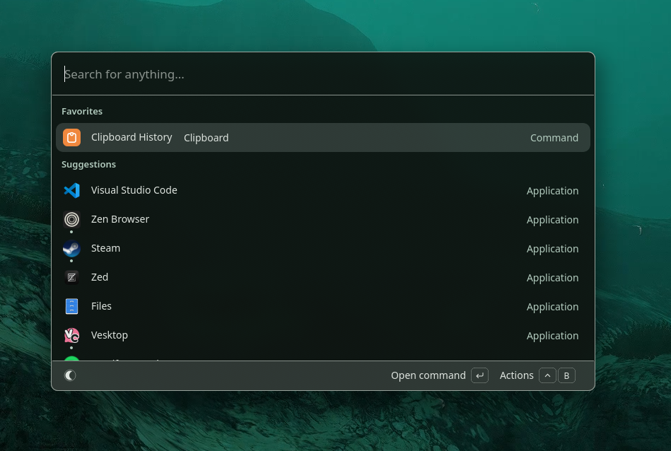
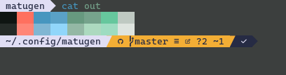

# Matugen templates

My personal matugen templates.

some are ripped from matugen-themes with modifications. some handmade.

Included:
- btop from matugen-themes
- dunst urgency colors
- modified matugen-themes gtk-colors.css
- ANSI sequences to modify many terminals
- adwsteamgtk theme with intent for dimension
- waybar.css from matugen-themes
- The matugen-themes zed theme modified to have a slight transparency.

 

 

 
